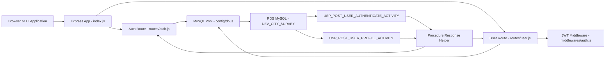
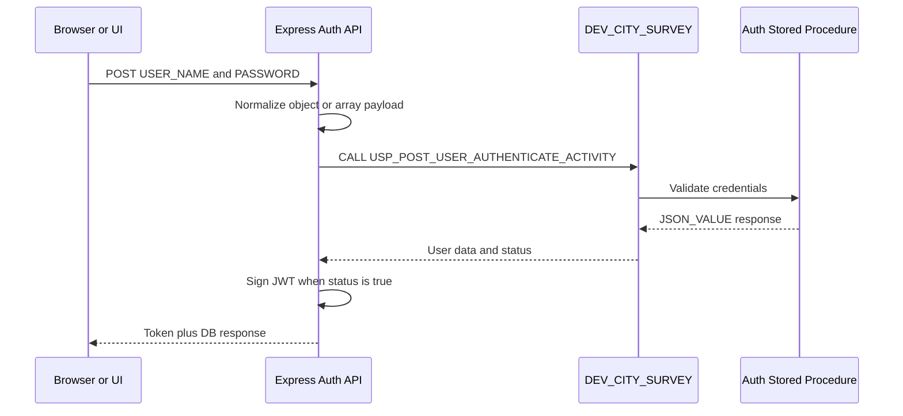
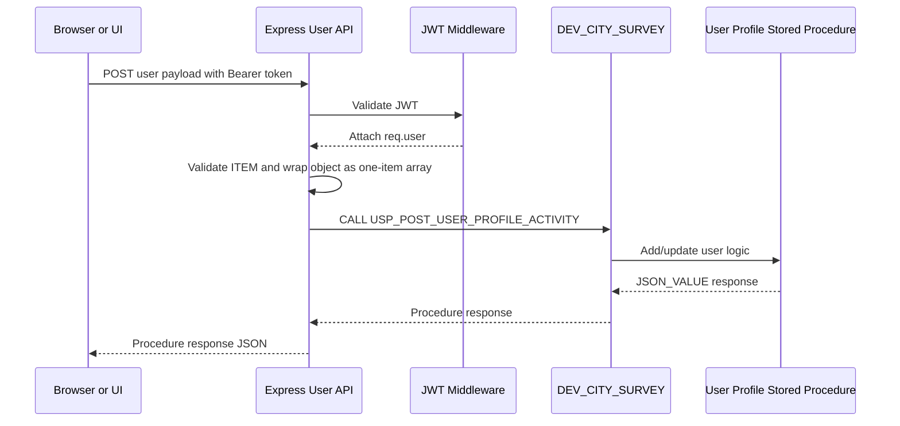

# Module Architecture and Scenario Flow

Date: 2026-07-08

## Current Backend Scope

The City Survey backend currently exposes two active business APIs:

- Authenticate a user through `USP_POST_USER_AUTHENTICATE_ACTIVITY`
- Add or update a user through `USP_POST_USER_PROFILE_ACTIVITY`

All other legacy event, attendee, payment, file upload, and email modules are
not mounted in `index.js` for this City Survey phase.

## Module Map

| Module | File | Responsibility | Current Status |
| --- | --- | --- | --- |
| App entry | `index.js` | Creates Express app, configures JSON parsing, CORS, routes, Swagger, and server port | Active |
| Database pool | `config/db.js` | Creates MySQL pool from `.env` values | Active |
| Auth route | `routes/auth.js` | Handles user authentication, calls auth stored procedure, signs JWT | Active |
| User route | `routes/user.js` | Handles add/update user, calls profile stored procedure | Active |
| JWT middleware | `middlewares/auth.js` | Validates `Authorization: Bearer <token>` before protected APIs | Active |
| Procedure helper | `utils/procedureResponse.js` | Normalizes stored procedure `JSON_VALUE` responses | Active |
| Swagger config | `docs/swagger.js` | Builds Swagger docs only for active City Survey routes | Active |
| Legacy routes | `routes/event.js`, `routes/master.js`, `routes/payment.js`, and others | Old iideas/event application APIs | Not mounted |

## Current Runtime Configuration

- Local configured port: `3103`
- Local Swagger URL: `http://localhost:3103/api/api-docs`
- Swagger server URL: `/`
- Port conflict handling: `index.js` catches `EADDRINUSE` and prints a clear
  message asking the developer to stop the existing process or update `PORT`.

Swagger intentionally uses a relative server URL. This prevents the Swagger UI
from calling old hardcoded ports such as `3000` when the backend is running on
`3103` or another configured port.

## High Level Architecture



## Request Flow: Authenticate User

Endpoint:

`POST /api/auth/api-post-authenticate-user`

Stored procedure:

`USP_POST_USER_AUTHENTICATE_ACTIVITY('AUTHENTICATE_USER', P_JSON, @ERRNO, @ERRMSG)`



### Auth Payload Accepted by API

Array format:

```json
[
  {
    "USER_NAME": "sai@yopmail.com",
    "PASSWORD": "Abc@1234"
  }
]
```

Object format also works:

```json
{
  "USER_NAME": "sai@yopmail.com",
  "PASSWORD": "Abc@1234"
}
```

The API also maps older frontend-style keys:

- `username` to `USER_NAME`
- `email` to `USER_NAME`
- `EMAIL_ID` to `USER_NAME`
- `password` to `PASSWORD`

## Request Flow: Add or Update User

Endpoint:

`POST /api/user/api-post-add-update-user`

Stored procedure:

`USP_POST_USER_PROFILE_ACTIVITY('ADD_UPDATE_USER', P_JSON, @ERRNO, @ERRMSG)`



### Important DB Shape Note

The DB handoff comment showed a plain object JSON example. The live stored
procedure currently extracts fields using `$[0]`, for example `$[0].ITEM` and
`$[0].USER_SYS_ID`.

Because of that, `routes/user.js` accepts a normal object from the frontend but
sends the stored procedure a one-item array:

```json
[
  {
    "ITEM": "ADD_USER",
    "USER_SYS_ID": 0
  }
]
```

This keeps the UI simple while matching the database implementation.

## Scenario Matrix

| Scenario | API | Input | Expected Result |
| --- | --- | --- | --- |
| Successful login | `POST /api/auth/api-post-authenticate-user` | Valid `USER_NAME` and `PASSWORD` | HTTP 200, `Token`, `status: true` |
| Missing login fields | `POST /api/auth/api-post-authenticate-user` | `{}` | HTTP 400, `USER_NAME and PASSWORD are required` |
| Invalid credentials | `POST /api/auth/api-post-authenticate-user` | Wrong password | HTTP 401 with DB response |
| Add existing user | `POST /api/user/api-post-add-update-user` | Existing `EMAIL_ID`, valid token | HTTP 200, DB response such as `This Email Id Already Exists` |
| Add new user | `POST /api/user/api-post-add-update-user` | Unique `EMAIL_ID`, valid token | HTTP 200, DB success response, new dev DB row |
| Missing bearer token | `POST /api/user/api-post-add-update-user` | No `Authorization` header | HTTP 401 |
| Invalid bearer token | `POST /api/user/api-post-add-update-user` | Bad token | HTTP 403 |
| Missing `ITEM` | `POST /api/user/api-post-add-update-user` | `{}` with token | HTTP 400, `ITEM is required` |
| DB unavailable | Any DB-backed API | RDS/network issue | HTTP 500 with error message |

## Module Ownership Boundaries

Backend owns:

- Route names and HTTP status mapping
- JWT token creation and validation
- Request payload normalization
- Stored procedure invocation
- Procedure response normalization

Database owns:

- Credential validation
- User existence validation
- User insert/update rules
- Role and organization references
- Stored procedure response messages

Frontend owns:

- Login form
- Token storage and protected route handling
- Add/update user form validation
- Displaying backend and DB response messages

## Inactive Legacy Code

The following files are still present for reference but are not mounted in the
City Survey app entrypoint:

- `routes/event.js`
- `routes/master.js`
- `routes/attendeesportal.js`
- `routes/payment.js`
- `routes/fileuploaddownload.js`
- `routes/emailcontroller.js`
- `emailService/*`
- `config/payment/*`

Do not wire these back into `index.js` unless a confirmed City Survey
requirement needs them.
